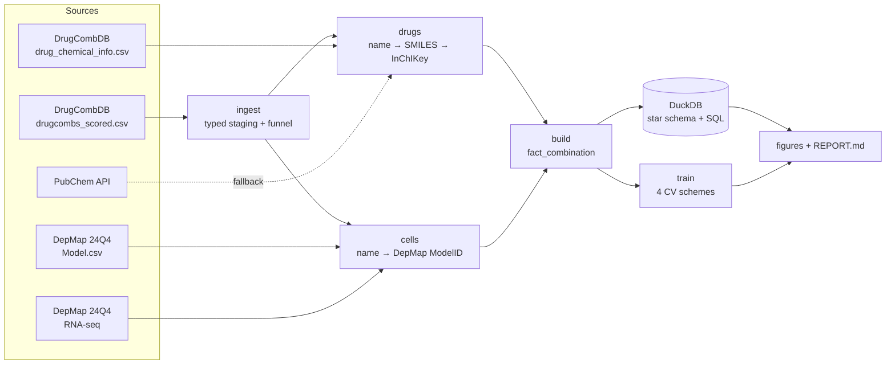

# DrugComb Synergy – from public screens to honest predictions

An end-to-end project on drug-combination synergy in cancer cell lines. It
covers data engineering, analysis and machine learning:

* **Data engineering:** a reproducible pipeline that downloads DrugCombDB and
  DepMap, resolves messy drug and cell-line names to canonical entities, and
  loads a star schema into DuckDB. It runs declarative data-quality checks and
  records the provenance (URL, release, SHA-256) of every input file.
* **Analytics:** SQL analyses and publication-style figures. How is synergy
  distributed, how reproducible is it, how does tissue context shift it, and
  how sparse is the screen?
* **Machine learning:** symmetric chemistry and biology features, strictly
  in-fold target statistics, and models evaluated under four split strategies
  of increasing difficulty. The evaluation reports how well the model
  generalises, not just how well it fits.

> **v2 is a rewrite.** The original school project lives in [`legacy/`](legacy/).
> The section [What changed since v1](#what-changed-since-v1) explains why.

All numbers and figures below come from running the pipeline
(`make all`). The full generated report is
[`reports/REPORT.md`](reports/REPORT.md), and the exact input files
(URL, release, SHA-256) are listed in
[`reports/data_manifest.json`](reports/data_manifest.json).

## Results at a glance

*DrugCombDB `drugcombs_scored.csv` × DepMap 24Q4 Public, 3 folds per split
strategy.*

| | |
|---|---|
| Raw measurements → modelling rows | 498 865 → **387 846** (drug pair × cell line) |
| Drug names → unique molecules | 5 347 → **4 188** (99.9 % of measurements have a structure) |
| Cell lines matched to DepMap | 105 of 119 human lines (83 % of measurements); 3 malaria strains excluded |
| Synergistic (ZIP > 10) / antagonistic (ZIP < −10) | 5.4 % / 9.5 % |
| Pairs tested in only one cell line | 87 % |
| Replicate agreement (a ceiling for any model) | Pearson r = **0.69** |

| Split | Best model | Pearson r | R² | AUPRC (synergy; prevalence 0.054) |
|---|---|---|---|---|
| Random rows | LightGBM + screen history | **0.63** | 0.40 | 0.47 |
| Unseen drug pair | LightGBM + screen history | **0.57** | 0.33 | 0.34 |
| Unseen drug | LightGBM, chemistry + biology¹ | **0.44** | 0.19 | 0.23 |
| Unseen cell line | Screen-history baseline² | **0.48** | 0.15 | 0.25 |

¹ Tied on r with the screen-history baseline (0.44), but much better calibrated
(R² 0.19 against 0.05).
² LightGBM with all features has a lower r (0.45) but the best R² (0.20).

What this shows:

* **On random rows the model is close to the noise ceiling.** r = 0.63,
  against 0.69 for two replicate measurements of the same experiment.
* **Most of that performance is memory of the screen.** The in-fold means per
  drug, cell line and pair (the "screen history") carry about 60 % of the
  model's gain. A plain ridge on those means gets within 0.02 of LightGBM.
* **Generalisation is the hard part.** Performance falls from 0.63 to 0.44
  for a drug the model has never seen. There the history features stop
  helping (0.41 with them, 0.44 without), and chemistry (descriptors,
  fingerprints, similarity) is what carries the prediction.
* **Cell-line biology adds little on top of the drug features.** RNA principal
  components receive under 1 % of the gain. With only about 90 screened lines,
  the model gets most of the cell effect from each line's in-fold mean ZIP.
* **The choice of synergy model matters.** ZIP correlates with Bliss at 0.92
  but only 0.25 with Loewe.

| | |
|---|---|
|  |  |
|  |  |
|  |  |
|  |  |

---

## Pipeline



| Stage | Module | Output |
|---|---|---|
| `download` | `download.py` | `data/raw/**` and `MANIFEST.json` (URL, release, sha256) |
| `ingest` | `ingest.py` | `stg_measurements.parquet`: typed and normalised, plus a funnel log |
| `drugs` | `drugs.py` | `dim_drug`, `bridge_drug_name`, Morgan fingerprints |
| `cells` | `cells.py` | `dim_cell`, RNA principal components, cell-line landscape |
| `build` | `build.py` | `fact_combination` (grain: drug pair × cell line), replicate pairs, QC report |
| `warehouse` | `warehouse.py` + `sql/` | `warehouse.duckdb` and `reports/tables/sql_*.csv` |
| `train` | `features.py`, `splits.py`, `model.py` | Metrics, out-of-fold predictions, feature importance |
| `figures`, `report` | `figures.py`, `report.py` | `reports/figures/*.png|svg`, `reports/REPORT.md` |

## Quick start

```bash
make install        # pip install -e ".[dev]"
make all            # download → … → report   (or: python -m drugsyn all)
make test           # unit + end-to-end tests on a synthetic fixture (no network)
```

Settings live in [`configs/default.yaml`](configs/default.yaml): DepMap
release, fingerprint size, number of RNA components, CV folds and LightGBM
parameters. Pass your own file with `python -m drugsyn all --config my.yaml`,
and it overrides only the keys it sets. For a quick run on a laptop, set
`model.max_rows: 50000`.

Data sources, file formats and manual-download instructions are in
[`docs/DATA.md`](docs/DATA.md).

---

## Data engineering

**Entity resolution is the core problem.** DrugCombDB merges several screens,
so the same molecule shows up as `5-FU`, `fluorouracil` and a CAS number, and
cell lines as `786-0`, `786-O` and `7860`.

* **Drugs.** Every name is normalised (NFKC, dash unification, case folding).
  It is then resolved to a structure through DrugCombDB's own chemical table,
  with PubChem as a cached fallback. The structure is standardised with RDKit
  (largest fragment for salt stripping, then neutralisation) and keyed by
  **InChIKey**. Synonyms therefore collapse into one `drug_key`, and a "pair"
  of two names for the same molecule is dropped as a self-combination.
* **Cell lines.** Names are matched to DepMap `ModelID`s through ranked keys
  (stripped name > cell-line name > CCLE name) plus a small, reviewed alias
  table ([`configs/cell_line_aliases.csv`](configs/cell_line_aliases.csv)).
  Non-human "cell lines" (malaria strains) are excluded explicitly rather than
  silently.
* **Aggregation happens after resolution.** Replicates are averaged per
  `(drug_1, drug_2, cell_key)`, with `drug_1 < drug_2` in canonical order. The
  replicate spread (`zip_std`, `n_replicates`) is kept.
* **Star schema in DuckDB:** `fact_combination`, `dim_drug`, `dim_cell`,
  `bridge_drug_name` and `replicate_pairs`, plus the view `v_combination`.
* **Data-quality checks** (grain uniqueness, referential integrity, canonical
  ordering, coverage) are written to `reports/tables/data_quality.csv` on
  every run.
* **Provenance:** every raw file's URL, release and SHA-256 goes into
  `MANIFEST.json`.

## Analysis

SQL lives in [`sql/analysis/`](sql/analysis). Each query writes a CSV to
`reports/tables/`:

| Query | Question |
|---|---|
| `kpi_overview` | How big is the dataset, and how many combinations are synergistic? |
| `synergy_by_lineage` | Does tissue context shift the synergy distribution? |
| `top_synergistic_pairs` | Which pairs are synergistic *consistently* (≥ 10 cell lines)? |
| `drug_profile` | Which drugs dominate the screen, and how do they combine? |
| `score_concordance` | Do ZIP, Bliss, Loewe and HSA agree? |
| `screen_coverage` | How much of the drug × drug × cell space was measured? |

The figures (in `reports/figures/`) cover the cleaning funnel, entity-resolution
coverage, the ZIP distribution, **replicate agreement** (an upper bound on what
any model can reach), score concordance, synergy by lineage, screen coverage,
the most consistent synergistic pairs, and where the screened cell lines sit in
DepMap expression space.

## Machine learning

**Features.** None of them uses the arbitrary order of drug_1 and drug_2.

| Family | Features | Uses labels? |
|---|---|---|
| Chemistry: fingerprints | Morgan (r = 2) bits summed over the pair (0/1/2), rare bits filtered | no |
| Chemistry: descriptors & similarity | Tanimoto similarity; sum and \|difference\| of 11 RDKit descriptors (MW, logP, TPSA, QED, …) | no |
| Biology | 32 RNA principal components (PCA fitted on *all* DepMap models), lineage | no |
| Screen history | Smoothed mean ZIP per drug, cell, pair and drug×cell, plus log counts | **yes – in-fold only** |

Screen-history features are recomputed inside every training fold. For the
training rows themselves they come from an inner 5-fold out-of-fold scheme.
Tests check that changing the test labels cannot change the test features.

**Evaluation.** Four split strategies, each with baselines:

| Split | What it simulates |
|---|---|
| Random rows | Filling gaps in a screen you have mostly run already |
| Unseen drug pair | Proposing a new combination of known drugs |
| Unseen drug | Adding a new compound to the library |
| Unseen cell line | Moving to a new tumour model |

Models: global mean, a screen-history baseline (ridge on the in-fold means),
LightGBM on chemistry + biology only, and LightGBM with everything. Metrics:
Pearson and Spearman r, RMSE, R², and AUPRC for "synergistic" (ZIP > 10)
together with its prevalence.

## What changed since v1

The v1 notebook reported R² ≈ 0.52 for an ensemble. Re-reading it turned up
several problems that make that number optimistic:

1. **The "grouped" split was effectively a random split.** Groups were
   `(drug_min, drug_max, cell_line)`, which is exactly the grain after
   aggregation, so every group held one row. The same pair (tested in other
   cell lines) and the same drugs were on both sides of the split.
2. **Ensemble weights were tuned on the validation set they were scored on.**
3. **Frequency features, winsorisation limits and fingerprint PCA were fitted
   on all rows before splitting.**
4. **The classifier's 0.91 accuracy matched the majority-class rate:** about 92 %
   of rows are "neutral".
5. Synonyms were not merged, so self-combinations and duplicate pairs remained.
   Unmatched cell lines were given all-zero RNA vectors.
6. The step that built the final modelling table was missing from the repo, so
   the results could not be reproduced.

v2 fixes each of these. On the same kind of random split, v2 reaches R² 0.40,
not 0.52. More importantly, it measures how well the model generalises to
unseen pairs, drugs and cell lines, which v1 could not do.

## Repository layout

```
configs/            default.yaml, cell_line_aliases.csv
docs/DATA.md        data sources, formats, manual download
sql/models/         warehouse views
sql/analysis/       analyst queries → reports/tables/sql_*.csv
src/drugsyn/        pipeline package (python -m drugsyn <stage>)
tests/              unit tests + synthetic end-to-end fixture
reports/            REPORT.md, figures/, tables/  (generated)
legacy/             the original v1 scripts and notebooks
```

## Disclaimer

For education and research only. This is not a medical tool, and its outputs
must not guide treatment decisions.
