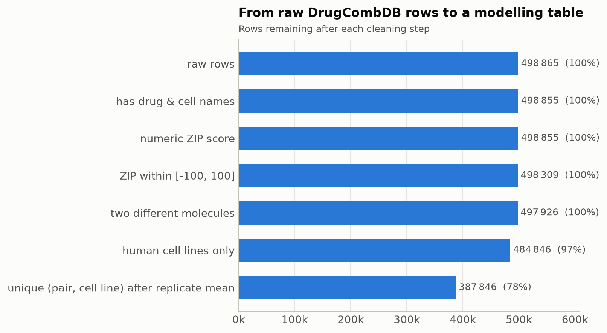
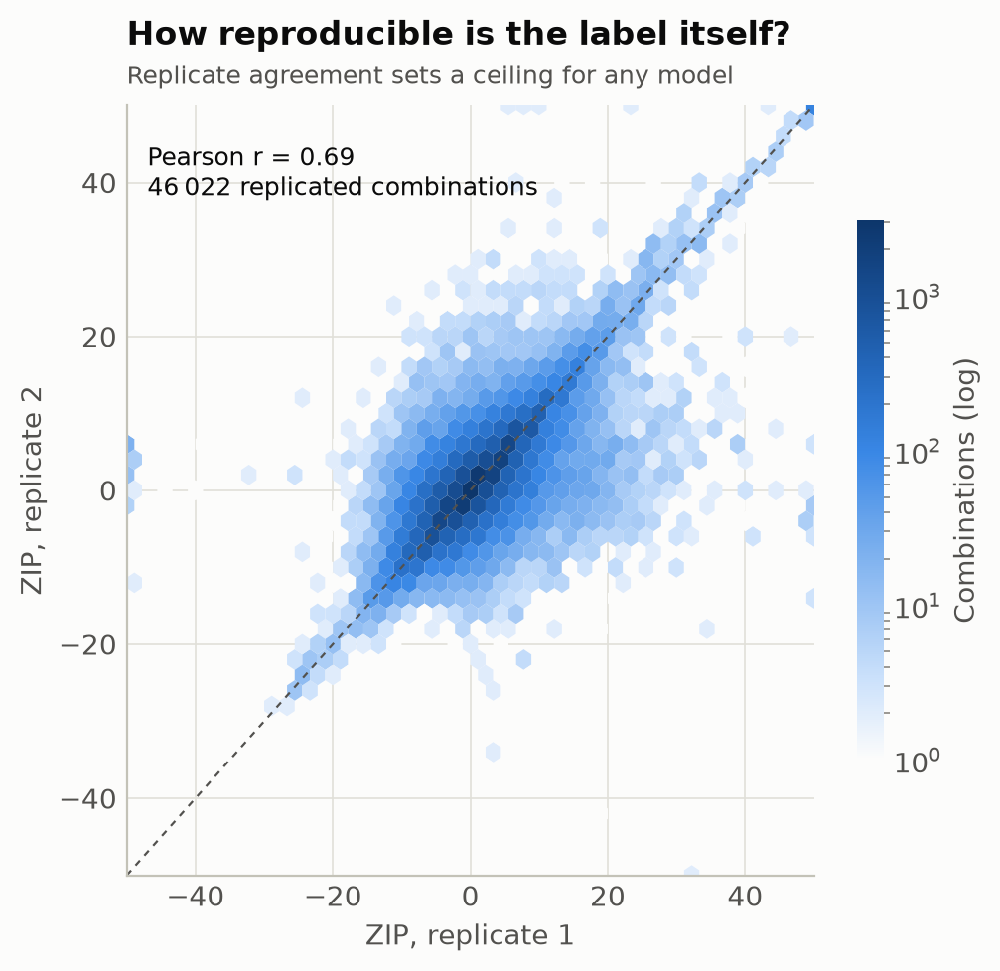
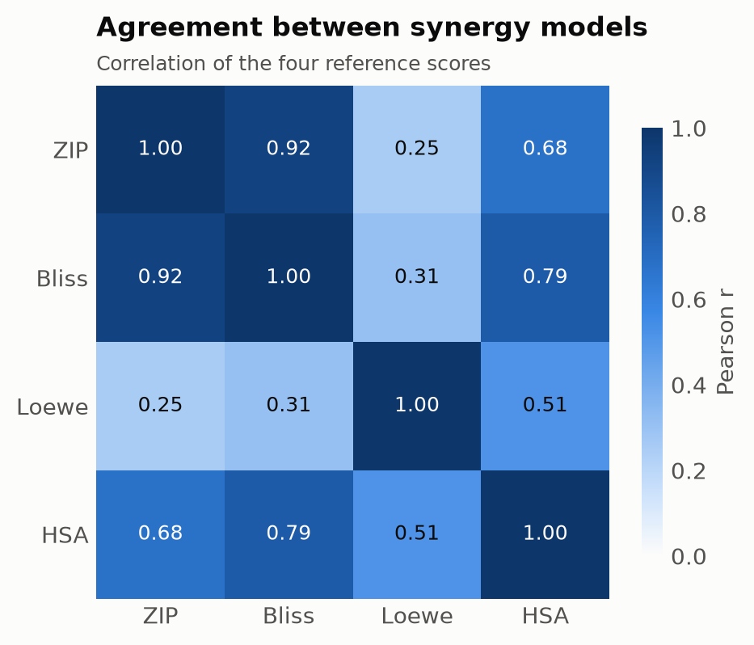
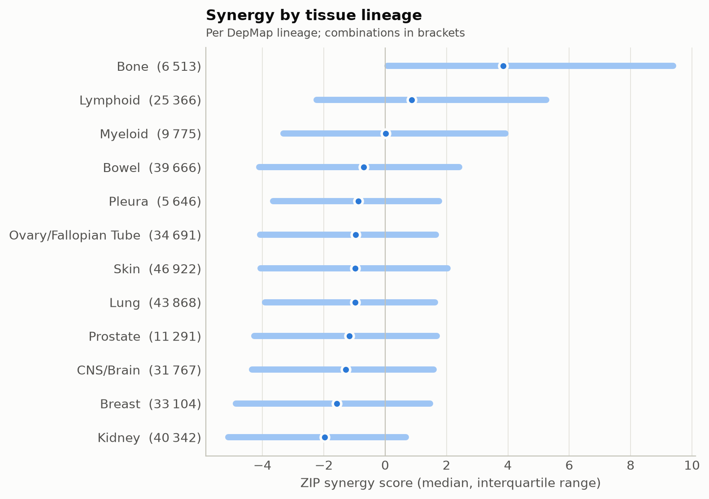
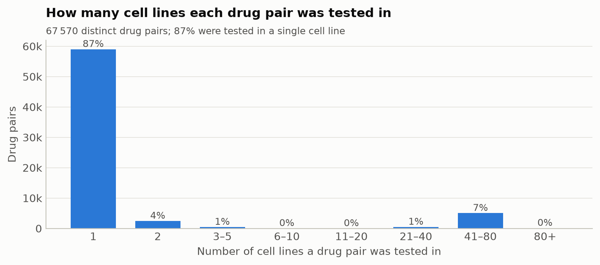
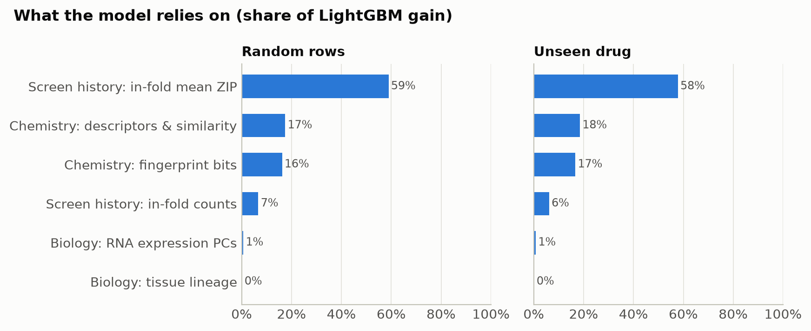

# DrugCombDB synergy – results report

_Generated by `drugsyn report` – do not edit by hand._

## Data provenance

| source | file | release | MB | sha256 | recorded_at |
| --- | --- | --- | --- | --- | --- |
| depmap | Model.csv | DepMap 24Q4 Public | 0.600 | b7a0c1385e6c… | 2026-09-23T20:06:34+00:00 |
| depmap | OmicsExpressionProteinCodingGenesTPMLogp1.csv | DepMap 24Q4 Public | 506.600 | 2a71dc94110e… | 2026-09-23T20:06:49+00:00 |
| drugcombdb | drug_chemical_info.csv | nan | 0.300 | c5331cb8e5ec… | 2026-09-23T20:06:31+00:00 |
| drugcombdb | drugcombs_scored.csv | nan | 32.300 | e821d3662703… | 2026-09-23T20:06:31+00:00 |

## Dataset at a glance

| metric | value |
| --- | --- |
| combinations | 3.878e+05 |
| drug_pairs | 6.757e+04 |
| drugs | 4188 |
| cell_lines | 119 |
| lineages | 15 |
| mean_zip | -1.6 |
| share_synergistic | 0.0544 |
| share_antagonistic | 0.0954 |
| share_with_structures | 0.9975 |
| share_with_rna | 0.7145 |

## Data engineering

### Data-quality checks

| check | passed | detail |
| --- | --- | --- |
| fact grain is unique (drug_1, drug_2, cell_key) | True | 0 duplicates |
| drug pairs are canonically ordered | True | nan |
| no self-combinations | True | nan |
| ZIP has no missing values | True | 0 missing |
| every drug_key exists in dim_drug | True | nan |
| every cell_key exists in dim_cell | True | nan |
| dim_drug key is unique | True | nan |
| dim_cell key is unique | True | nan |
| rows with structures for both drugs | True | 99.7% |
| rows with DepMap RNA for the cell line | True | 71.4% |

## Exploratory analysis

## Modelling

| split | model | pearson | spearman | rmse | r2 | auprc_synergy | prevalence_synergy |
| --- | --- | --- | --- | --- | --- | --- | --- |
| Random rows | Global mean | nan | nan | 9.365 | -0.000 | 0.054 | 0.054 |
| Random rows | Screen-history baseline | 0.617 | 0.638 | 7.380 | 0.379 | 0.420 | 0.054 |
| Random rows | LightGBM · chemistry + biology | 0.586 | 0.584 | 7.592 | 0.343 | 0.393 | 0.054 |
| Random rows | LightGBM · + screen history | 0.635 | 0.661 | 7.267 | 0.398 | 0.472 | 0.054 |
| Unseen drug pair | Global mean | nan | nan | 9.419 | -0.000 | 0.054 | 0.054 |
| Unseen drug pair | Screen-history baseline | 0.565 | 0.546 | 7.890 | 0.298 | 0.321 | 0.054 |
| Unseen drug pair | LightGBM · chemistry + biology | 0.551 | 0.522 | 7.863 | 0.303 | 0.332 | 0.054 |
| Unseen drug pair | LightGBM · + screen history | 0.572 | 0.560 | 7.731 | 0.326 | 0.338 | 0.054 |
| Unseen drug | Global mean | nan | nan | 9.818 | -0.003 | 0.055 | 0.055 |
| Unseen drug | Screen-history baseline | 0.444 | 0.408 | 9.567 | 0.048 | 0.233 | 0.055 |
| Unseen drug | LightGBM · chemistry + biology | 0.443 | 0.393 | 8.799 | 0.194 | 0.226 | 0.055 |
| Unseen drug | LightGBM · + screen history | 0.410 | 0.395 | 9.144 | 0.130 | 0.226 | 0.055 |
| Unseen cell line | Global mean | nan | nan | 6.618 | -0.056 | 0.054 | 0.054 |
| Unseen cell line | Screen-history baseline | 0.485 | 0.492 | 5.940 | 0.149 | 0.251 | 0.054 |
| Unseen cell line | LightGBM · chemistry + biology | 0.413 | 0.421 | 6.034 | 0.120 | 0.244 | 0.054 |
| Unseen cell line | LightGBM · + screen history | 0.454 | 0.430 | 5.770 | 0.197 | 0.254 | 0.054 |

